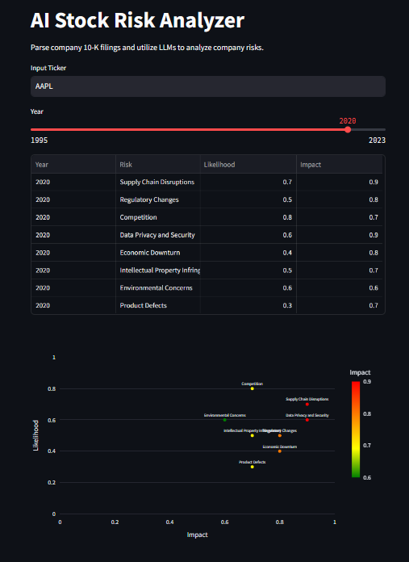

# AI Stock Risk Analyzer (ASRA)

Using a LLM, generate risk insights from company 10-K filings.

## Use

To comply with SEC download guidelines, all downloaders must have an identifier. Set your EDGAR identity in your environmental variables:

> setx EDGAR_IDENTITY "\<first name> \<last name> \<email address>"

Create an [Gemini API key](https://aistudio.google.com/app/apikey). Set your API key in your environmental variables:

> setx GOOGLE_API_KEY "\<your key>"

Run the app.

> streamlit run app.py

## Technical Details

[edgartools](https://pypi.org/project/edgartools/) downloads company 10-K filings from the SEC EDGAR database. All filings between 1995 and 2023 (roughly 29 documents) will be downloaded.

Retrieval-augmented generation feeds 10-K documents to the LLM. Combined with other prompt engineering, the LLM then generates specified risk insights. Risk insights are valuable for analysts to understand potential downsides, volatility, and vulnerabilities associated with a company. The LLM is asked to parse the 10-K filing, identify the risks, and judge the likelihood and impact factor of the risks.

[langchain](https://github.com/langchain-ai/langchain) chunks text into sub-documents. Embedding these chunks forms a vector database that is searched for relevant chunks to retrieve for our queries.

ASRA utilizes Google's Gemini LLM model for text inference. An [API key](https://aistudio.google.com/app/apikey) is required. Many LLMs are suitable for inference, but Gemini was chosen due to its popularity, free-tier usage support, and support from third-party libraries.

A basic frontend is deployed via [Streamlit](https://streamlit.io/) to visualize the returned risk matrix and scatterplot. Streamlit is a pure-Python frontend tool to deploy sleek webapps quickly, and was chosen for its simplicity.
